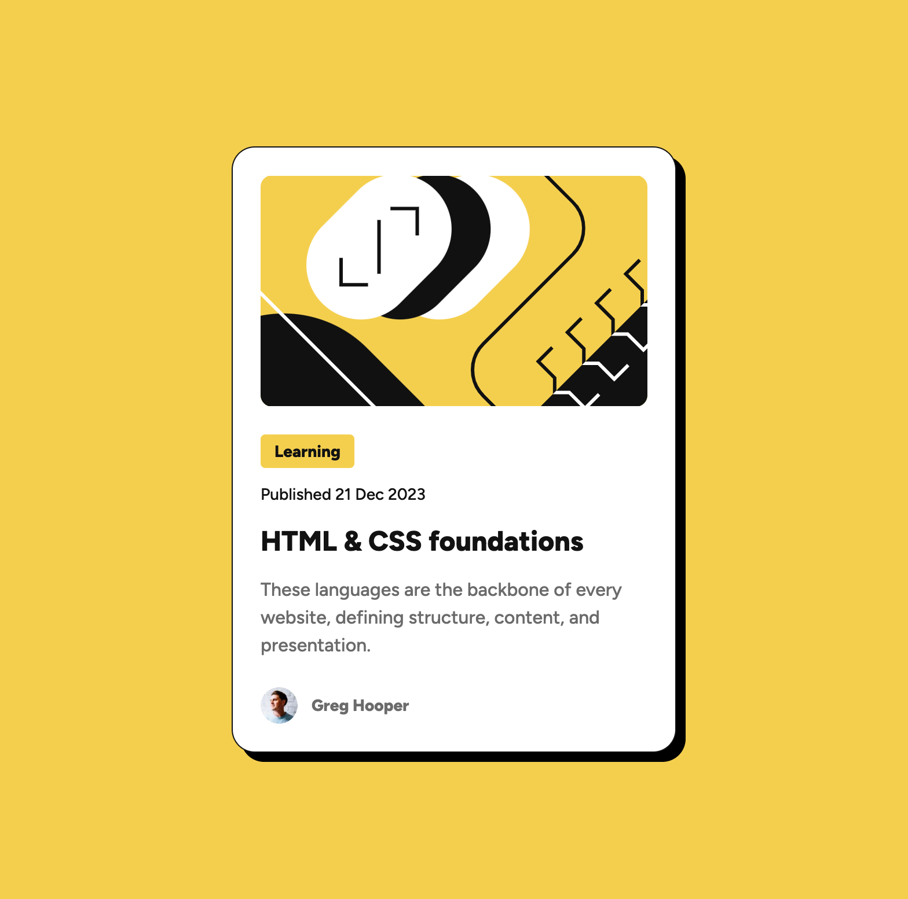

# Frontend Mentor - Blog preview card solution

This is a solution to the [Blog preview card challenge on Frontend Mentor](https://www.frontendmentor.io/challenges/blog-preview-card-ckPaj01IcS). Frontend Mentor challenges help you improve your coding skills by building realistic projects.

## Table of contents

- [Overview](#overview)
  - [The challenge](#the-challenge)
  - [Screenshot](#screenshot)
  - [Links](#links)
- [My process](#my-process)
  - [Built with](#built-with)
  - [Useful resources](#useful-resources)
- [Author](#author)

## Overview

### The challenge

Users should be able to:

- See hover and focus states for all interactive elements on the page

### Screenshot

### Links

- Solution URL: [Add solution URL here](https://your-solution-url.com)
- Live Site URL: [Add live site URL here](https://your-live-site-url.com)

## My process

### Built with

- Semantic HTML5 markup
- [CUBE CSS](https://cube.fyi/)
- [Utopia](https://utopia.fyi/)
- CSS custom properties
- Flexbox
- CSS Grid
- Mobile-first workflow

### Useful resources

- [Utopia.fyi](https://utopia.fyi/) - A group of tools that help with flexible, responsive layouts, type scales, and spacing scales.
- [CUBE CSS](https://cube.fyi/) - CUBE CSS is a CSS methodology that’s orientated towards simplicity, pragmatism and consistency.
- [Every Layout](https://every-layout.dev/) - A series of simple, composable layouts.
- [Inclusive Components](https://inclusive-components.design/) - A series of components focussed on accessibility and reusability.

## Author

- Frontend Mentor - [@dave-cross](https://www.frontendmentor.io/profile/dave-cross)
- Youtube - [@dave-cross](http://youtube.com/@dave-cross)
